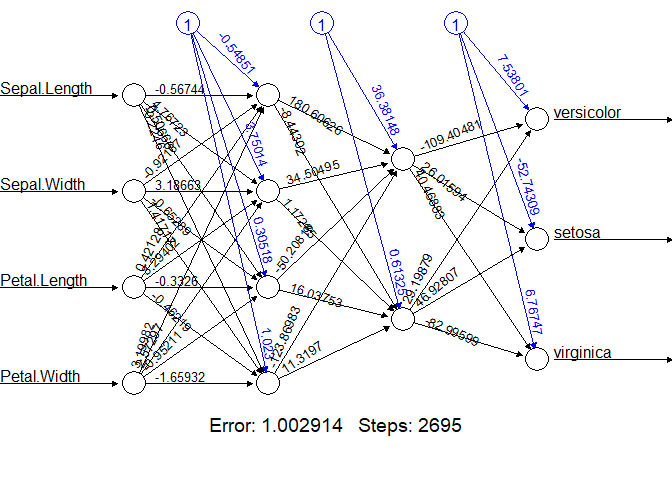

NN\_training
================
Faith Igomodu
July 8, 2024

## Building a Neural Network in R

Neural networks are machine learning algorithm that attempts to mimic
how human neuronal cells work and the objective of this project is to
build a neural network algorithm using Iris dataset to solve
multi-classification problems.

### Install packages

``` r
#install.packages(c("neuralnet", "keras", "tensorflow"), dependencies = T)
```

### Load packages

``` r
library(neuralnet)
```

    ## Warning: package 'neuralnet' was built under R version 4.4.1

``` r
library(keras)
```

    ## Warning: package 'keras' was built under R version 4.4.1

``` r
library(tensorflow)
```

    ## Warning: package 'tensorflow' was built under R version 4.4.1

``` r
library(tidyverse)
```

    ## ── Attaching core tidyverse packages ──────────────────────── tidyverse 2.0.0 ──
    ## ✔ dplyr     1.1.4     ✔ readr     2.1.5
    ## ✔ forcats   1.0.0     ✔ stringr   1.5.1
    ## ✔ ggplot2   3.5.1     ✔ tibble    3.2.1
    ## ✔ lubridate 1.9.3     ✔ tidyr     1.3.1
    ## ✔ purrr     1.0.2     
    ## ── Conflicts ────────────────────────────────────────── tidyverse_conflicts() ──
    ## ✖ dplyr::compute() masks neuralnet::compute()
    ## ✖ dplyr::filter()  masks stats::filter()
    ## ✖ dplyr::lag()     masks stats::lag()
    ## ℹ Use the conflicted package (<http://conflicted.r-lib.org/>) to force all conflicts to become errors

### Exploratory Data Analysis

``` r
#Why convert characters to factors?

iris <- iris%>% mutate_if(is.character , as.factor)
```

``` r
# why is it important that each type of flower each have 50 samples? Why does the dataset need to be balanced?
summary(iris)
```

    ##   Sepal.Length    Sepal.Width     Petal.Length    Petal.Width   
    ##  Min.   :4.300   Min.   :2.000   Min.   :1.000   Min.   :0.100  
    ##  1st Qu.:5.100   1st Qu.:2.800   1st Qu.:1.600   1st Qu.:0.300  
    ##  Median :5.800   Median :3.000   Median :4.350   Median :1.300  
    ##  Mean   :5.843   Mean   :3.057   Mean   :3.758   Mean   :1.199  
    ##  3rd Qu.:6.400   3rd Qu.:3.300   3rd Qu.:5.100   3rd Qu.:1.800  
    ##  Max.   :7.900   Max.   :4.400   Max.   :6.900   Max.   :2.500  
    ##        Species  
    ##  setosa    :50  
    ##  versicolor:50  
    ##  virginica :50  
    ##                 
    ##                 
    ## 

### Data Analysis

80/20 split of Iris dataset for training and testing is completed.

``` r
#seed for reproducibility 
set.seed(245)
```

``` r
#Calculate rows to be used for training data by multiplying the total number of rows in iris dataset by 0.8

data_rows <- floor(0.80 * nrow(iris))
```

``` r
#Randomly select data-rows indices from range of 1 to total number of rows in iris dataset using sample function 

train_indices <- sample(c(1:nrow(iris)), data_rows)
```

``` r
#select rows that correspond to the sampled indices from theiris dataset and assign them to trian_data variable 

train_data <- iris[train_indices,]
```

``` r
#select the rows that were not selected for training and assign them to the test_data variable 

test_data <- iris[-train_indices,]
```

### NN Model

The model should predict the speices of isis flower given the sepal
length, with and petal length, width.

Target Variable: Species

Predictor variables: Sepal.length, Sepal.Width, Petal.Length, and
Petal.Width

``` r
# The neural network model of Isis dataset 


isis_model <- neuralnet(
  Species ~ Sepal.Length+Sepal.Width+Petal.Length+Petal.Width,
  #specifies the  traing dataset 
  data = train_data,
  #Species the number of hidden layers and number f neurons in each layer. The code below   specifies two hidden layers and with four and two neurons 
  hidden = c(4,2),
  #specifies the output should not be linear 
  linear.output = FALSE
)
```

Questions:

What does error and step mean in the image of the model below?

``` r
#plot function is used to view the neural network model architecture (structure)

plot(isis_model, rep = "best")
```

<!-- --> \#\#\#
Model Evaluation

A confusion matrix is generated to evaluate the model performance by

-   Predicting categories using test dataset
-   Create a list of category names
-   Create a prediction dataframe and replace numerical outputs with
    labels. \*Use tables to display actual and predicted values sided by
    side

``` r
#predict function used to make predictions on test data using trained model 

predicted <- predict(isis_model, test_data)
# A vector of three species of isis flower plants in dataset 
labels <- c("sestosa", "versicolor", "virginca")
#creates a data frame with column index of max value in each row of the predicted variable using the max.col function which results in a dataframe with one column 
prediction_label <- data.frame(max.col(predicted))%>%
#adds a new column to data frame called predicted  
mutate(predicted = labels[max.col.predicted.])%>%
#Use select function to keep only the predicted column in the dataframe   
select(2)%>%
#Use unlist function to convert dataframe into a vector   
unlist()
#creates a table that compares the actual species in the test data to the predicted species 
table(test_data$Species, prediction_label)
```

    ##             prediction_label
    ##              sestosa versicolor virginca
    ##   setosa           8          0        0
    ##   versicolor       0         13        0
    ##   virginica        0          3        6

``` r
#notes 
#How do you improve the model without adding more complexity - that is more neurons to each layer? The model predicted three species incorrectly. 
```

The accuracy of the model is checked by converting categorical values
into numerical ones and compare them to predicted values. The model has
predicted values with 90% accuracy.

``` r
check = as.numeric(test_data$Species) ==  max.col(predicted)
accuracy = (sum(check)/nrow(test_data))*100
print(accuracy)
```

    ## [1] 90
